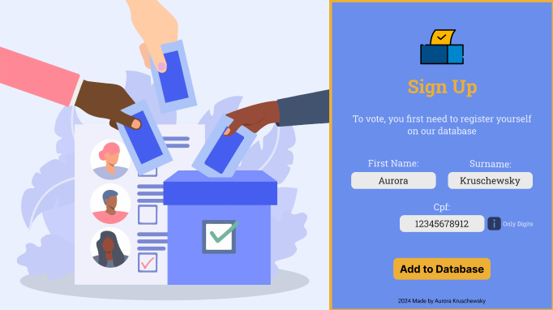
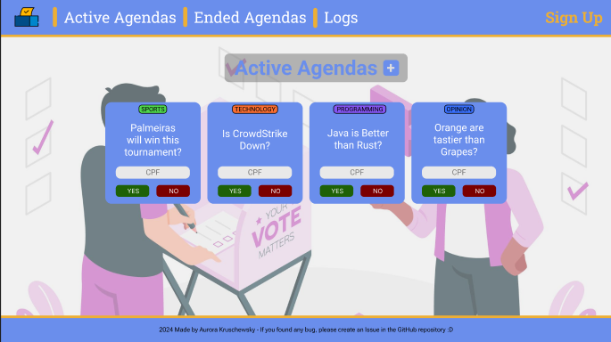
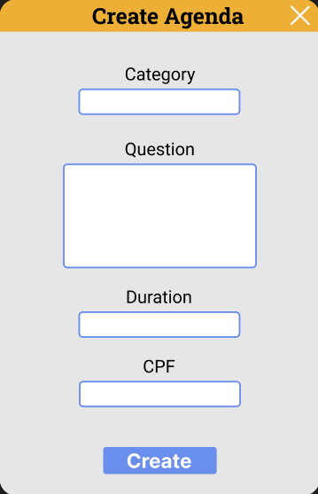
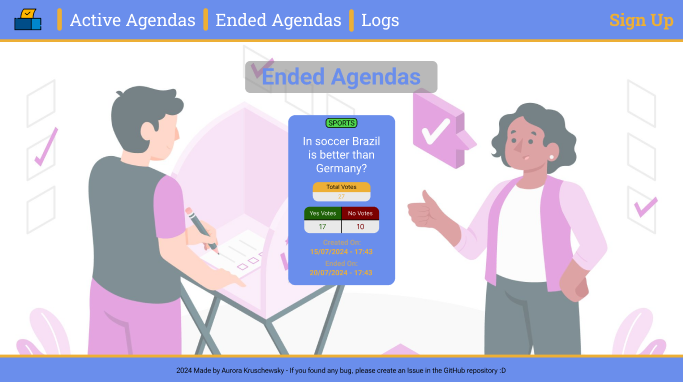
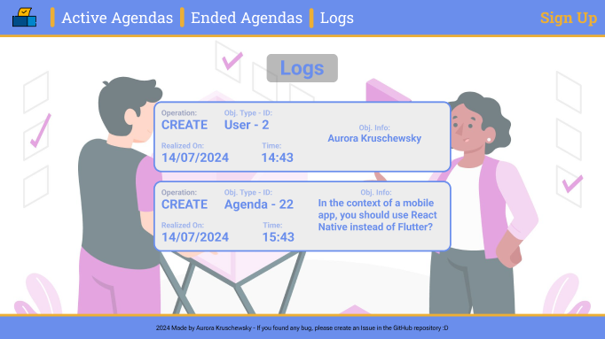

# 🎟️ VotacaoCRUD FrontEnd

As the title says, this project is the FrontEnd for the (Voting API)[https://github.com/AurorinhaBoreal/VotacaoCRUD-BackEnd].

In conjuction with the API, with this FrontEnd you can register Users, create Agendas and vote in the respective agendas.

## Table of Contents
- [✨ Running the Project](#running-the-project)
- [🎨 Choosen Design](#design-of-the-pages)
- [🏗️ Developing the Project](#developing-the-project)
- [📄 License](#license)

## Running the Project

To run the the front end is simple.

You have two options:

- Either you can simply access the deployed version [Here](https://votacao-front.onrender.com/)

- Or you can create a Docker Image and Container locally through the commands

  - Create the docker image ```docker compose up -d```
  
Obs: To run the frontEnd with the backEnd locally you have to change the API_URL env variable to the localhost. You need to do it before running docker compose up -d, or else you'll have to delete the container and the image that was already created using ```docker rm [containerID]``` and ```docker rmi [imageID]``` respectively.

## Choosen Design

This subtopic refers to the design and pages made in Figma that will be used as base for the design of the frontEnd.

First of all we have the Home page that will be the signUp one, It allows you to add a User as you enter the site.



After we Sign Up we will be redirected to the Active Agendas Page were... It will show us exactly that.



Using the "+" Button we can create a new agenda trough a modal



We can click on the "Ended Agendas" to be redirected to the Ended Agendas Page



And last but no least you can see the create and vote logs clicking on "Logs" localized also in the header



## Developing the Project

This topic refers to all the technologies used in the project and the steps to build it using them.

### Technologies & Tools

- ⚛️ React
- #️⃣ TypeScript
- 🐋 Docker
- 🎨 Figma

### US's - MPV

- ✅ [US000] Configure Repository
  - ✅ [US000-1] Implements a README
  - ✅ [US000-2] Configure GitHub Actions
- ✅ [US001] Configure Project
  - ✅ [US001-1] Create Design
  - ✅ [US001-2] Create React App
  - ✅ [US001-3] Implement React Routes
- ✅ [US002] Home Page
  - ✅ [US002-1] Main Structure
  - ✅ [US002-2] Sign Up Form
  - ✅ [US002-3] Create User Method
- ✅ [US003] Active Agendas Page
  - ✅ [US003-1] Create Main Structure
  - ✅ [US003-2] Get Active Agenda Method
  - ✅ [US003-3] Create Agenda Modal
  - ✅ [US003-4] Create Agenda Method
  - ✅ [US003-5] Active Agenda Component
  - ✅ [US003-6] Logic for End of the Agenda
  - ✅ [US003-7] Timed Component
  - ✅ [US003-8] Vote Logic
- ✅ [US004] Ended Agendas Page
  - ✅ [US004-1] Get Ended Agenda Method
  - ✅ [US004-2] Ended Agenda Component
- ✅ [US005] Logs Page
  - ✅ [US005-1] Get Log Method
  - ✅ [US005-2] Create Log Card

### US's - Extra

- ✅ [US00X] Extra Features
  - ✅ [US00X-1] Refactor for Better Responsiveness - MediaQuery


## License
This project is licensed under the Apache 2.0 License. See the [LICENSE](LICENSE) file for details.
